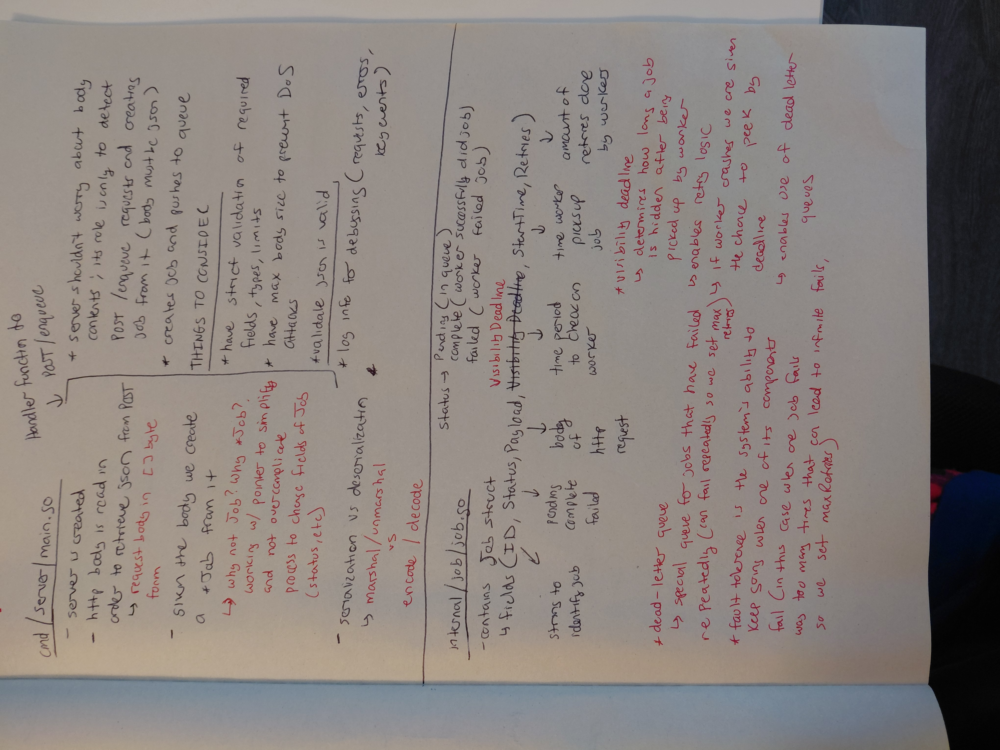
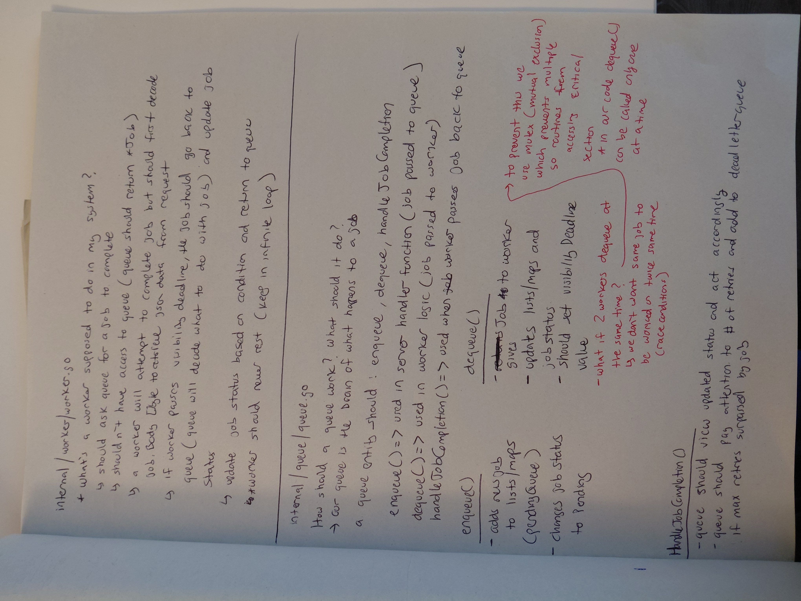

# Distributed Queue Project
A high performance distributed queue system built with Go and AWS, designed to handle concurrent tasks efficiently with robust worker management and queue orchestration.

## Project Overview
This project implements a scalable distributed queue that allows multiple producers and consumers to enqueue and process jobs concurrently. 
It provides:
- Thread-safe queue operations with mutex locks to prevent race conditions
- Worker management for parallel job processing
- Support for enqueueing and dequeueing tasks reliably
- Designed for high throughput and low latency in distributed systems

## Features
- Concurrent Job Processing: Multiple workers process jobs simultaneously without conflicts
- Thread-Safe Queue: Ensures data consistency using mutexes
- RESTful API: Expose enqueue/dequeue operations through HTTP endpoints
- Scalable Architecture: Easy to add more workers or nodes in a distributed setup
- AWS-Ready Deployment: Can be integrated with AWS services for cloud based scalability

## Tech Stack
- Golang (Core language for queue and worker logic)
- AWS (Cloud deployment and potential integration with services like SQS or EC2)
- HTTP and REST (API endpoints for interacting qwith the queue)
- Concurrency Primitives (Mutex, Goroutines for safe parallel processing)

## Skills and Learnings
- Go concurrency and synchronization (mutexes, goroutines)
- Distributed system design
- API design and RESTful service implementation
- Cloud-ready architecture with AWS integration potential
- Thread safe data structures and high-throughput queue management
- 

